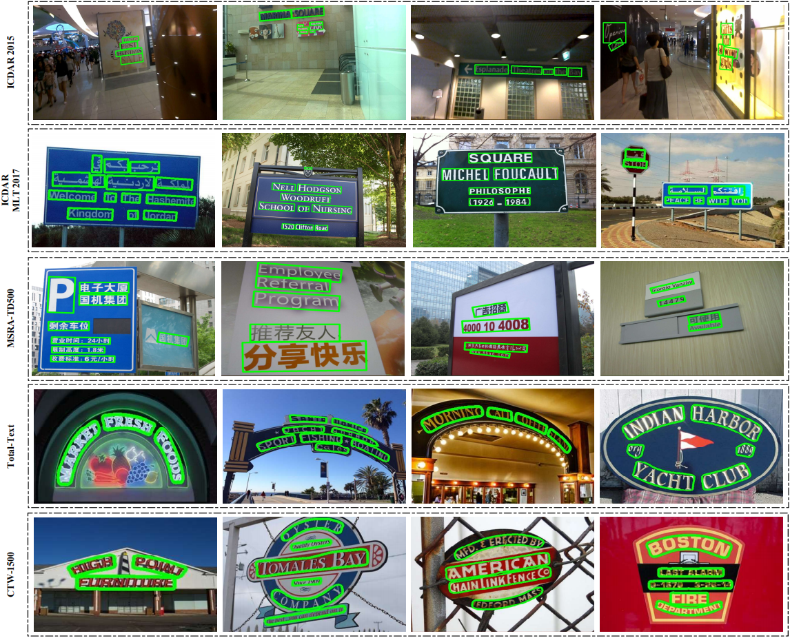

# ProNet

This is the official implementation of "ProNet: Shape-robust Scene Text Detection via Compatible Text Proposals".

Complete Codes are coming soon. :rocket:

## Abstract

Most existing scene text detectors rely on convolutional neural networks for feature extraction. Although convolution contains preliminary information including translation invariance, it has a limited receptive field and could not flexibly adapt to text instances of variable shapes. In this paper, we propose a shape-robust scene text detection network with compatible text proposals, termed as ProNet. We aim to provide a new perspective for text representations that treat it as modeling global context for sequence. Specifically, we apply a pure Transformer to dense image patches and fuse features of different scales through multi-stage Transformer blocks. With this, scene text detectors can obtain anchors containing global context. We propose an Adaptive Text Anchor Matching (ATAM) module to assign positive and negative training samples according to scores in a probabilistic way to further boost the quality of text proposals. It significantly improves the performance of proposal-based scene text detectors compared to simply relying on a fixed threshold.

## Testing Results

* Testing results on ICDAR 2015, ICDAR 2017, MSRA-TD500, Total-Text and CTW-1500.

    

    

